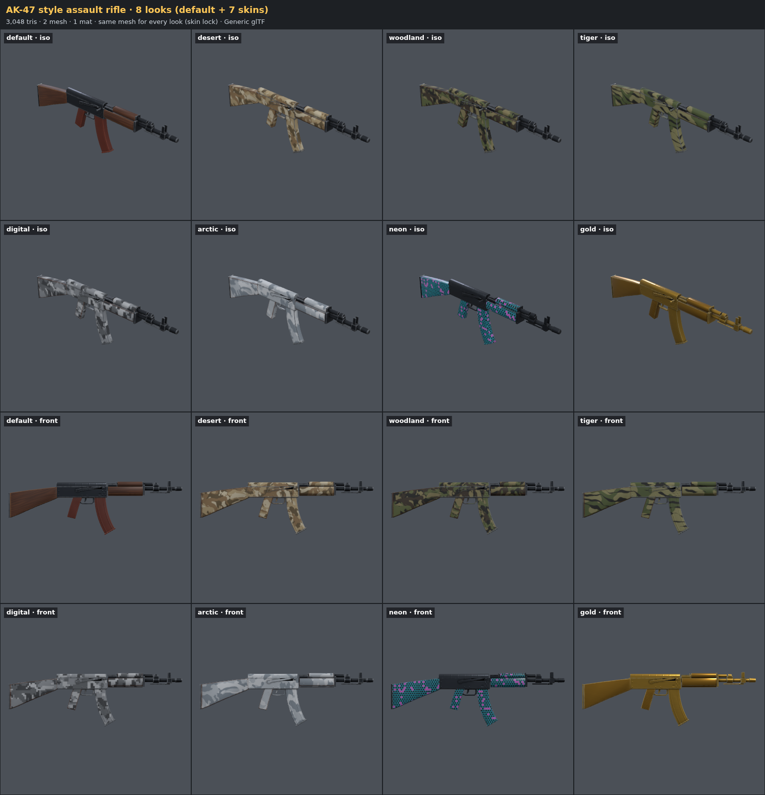

# AI 3D Asset Studio

Describe a game asset in plain language. An AI coding agent writes it as **procedural Three.js
code**, you watch it in a **live viewport** that shows the exported file, ask for changes, and
export a **GLB that looks the same in Godot and Roblox Studio**.

**Prompt → Generate → Preview → Revise → Export**




## Quick start

```bash
npm install
npx playwright install chromium     # headless renders (Linux: --with-deps)
node studio doctor                  # environment check

node studio dev                     # terminal 1: live viewport → http://127.0.0.1:5178
claude                              # terminal 2: then type  /asset A stylized wooden barrel with chunky iron hoops
```

Then ask for changes ("make the hoops thinner"), go back with `/asset-undo`, and export with
`/asset-export stylized-barrel roblox`. The same shortcuts work in **Gemini CLI** (`/asset …`)
and **Codex** (`$asset …`), and any agent that reads `AGENTS.md` follows the workflow from plain
requests. The full walkthrough is in the **[User Guide](docs/GUIDE.md)**.

## What's inside

- **Agent workflow:** `AGENTS.md` (any coding agent), `CLAUDE.md`, and nine shortcuts written
  once as Agent Skills (`.agents/skills/`): `asset`, `asset-revise`, `asset-variants`,
  `asset-skins`, `asset-set`, `asset-review`, `asset-export`, `asset-publish`, `asset-undo`. Use them as `/asset …` in Claude Code
  and Gemini CLI, or `$asset …` in Codex. The agent reviews its own work from rendered contact
  sheets of the exported GLB.
- **Kit** (`studio/kit`): geometry, operators, UV tools and atlas packing, a texture painter
  (wood, bricks, rust, panels…), PBR materials, CSG, terrain, architecture helpers, seeded
  randomness. See [docs/KIT.md](docs/KIT.md).
- **Preview = Export:** the viewport only loads exported GLBs, and `export` refuses to write a
  file that differs from the preview.
- **Engine profiles:** Generic glTF, Godot, Roblox Studio. The Roblox profile handles studs,
  colors baked into textures, a palette atlas, one material per MeshPart, ≤ 1024 px textures, the
  20k-triangle split and UV-padding dilation.
- **Validator:** UV island padding at the final texture size, texture size and texel density,
  triangles per mesh, geometry, materials, scene and source checks. Errors block export.
- **Revisions:** versions with your words, visual diffs (changed pixels in red/orange),
  undo/revert/pin. See the [three-revision demo](docs/demos/phase4.md).
- **Multiple assets:** sets from one prompt with a shared style, and variants of one asset.
- **Skins:** many looks on the exact same mesh (camos, gold, neon), painted in 3D so patterns
  cross UV seams, checked by a skin lock, exported as Roblox SurfaceAppearance packs with a
  switcher, one `KHR_materials_variants` GLB, or per-look GLBs. See the
  [AK skins demo](docs/demos/skins.md).
- **Publish to Roblox:** `node studio publish <asset> --roblox [--skins]` uploads through Open
  Cloud (new versions on re-publish, images reused), no manual import.
- **Reliability:** a golden suite (42 items × 3 profiles: validation, determinism, structure,
  regression, parity), real-engine verification in **Godot 4.7.2 (42/42)**, a Roblox Studio pack
  with a verify script and checklist, and CI.
- **Modeling knowledge:** `rules/` covers silhouette, proportion, detail, materials, topology,
  parts and pivots, export hygiene, styles, sets, revisions and limitations, plus core guides for
  **environments/terrain, buildings/houses, nature and weapons**, plus skins and 3D-painted textures.

## Documentation

| Doc | For |
| --- | --- |
| [docs/GUIDE.md](docs/GUIDE.md) | Users: install, prompting, viewport, revisions, export to Godot/Roblox, environment/house/nature essentials, CLI, troubleshooting |
| [docs/KIT.md](docs/KIT.md) | The kit API used in `assets/<slug>/asset.js` |
| [docs/ARCHITECTURE.md](docs/ARCHITECTURE.md) | How the pipeline, viewport, validator and tests fit together |
| [docs/DECISIONS.md](docs/DECISIONS.md) | Answers to the PRD's open questions, engine research, verification status |
| [docs/demos/](docs/demos/) | Evidence per PRD phase ([1](docs/demos/phase1.md) · [2](docs/demos/phase2.md) · [3](docs/demos/phase3.md) · [4](docs/demos/phase4.md) · [5](docs/demos/phase5.md)) and the [skins demo](docs/demos/skins.md) |
| [engines/roblox/CHECKLIST.md](engines/roblox/CHECKLIST.md) · [engines/godot/README.md](engines/godot/README.md) | Engine checks |
| [docs/PRD — AI 3D Asset Studio.md](<docs/PRD — AI 3D Asset Studio.md>) | The product requirements |

## Status

| | |
| --- | --- |
| Tests | `npm test`: 55 tests |
| Golden suite | `node studio golden`: 126/126 |
| Godot 4.7.2 | `node studio engine-verify godot`: 42/42 golden items import without manual fixes |
| Roblox Studio | Prepared (`node studio engine-pack roblox`). The import is checked by hand with the [checklist](engines/roblox/CHECKLIST.md), because Studio has no headless mode |

Requires Node.js 20.11+. No build step, no cloud services: everything runs locally.
