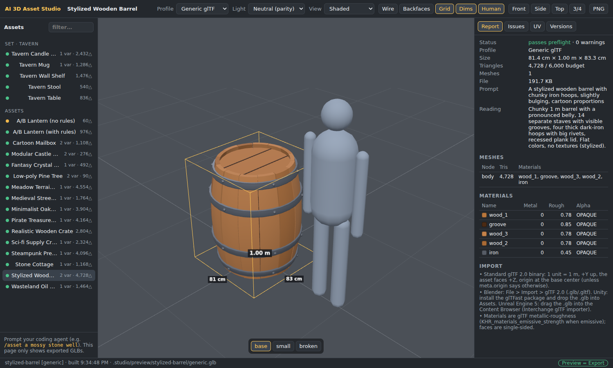
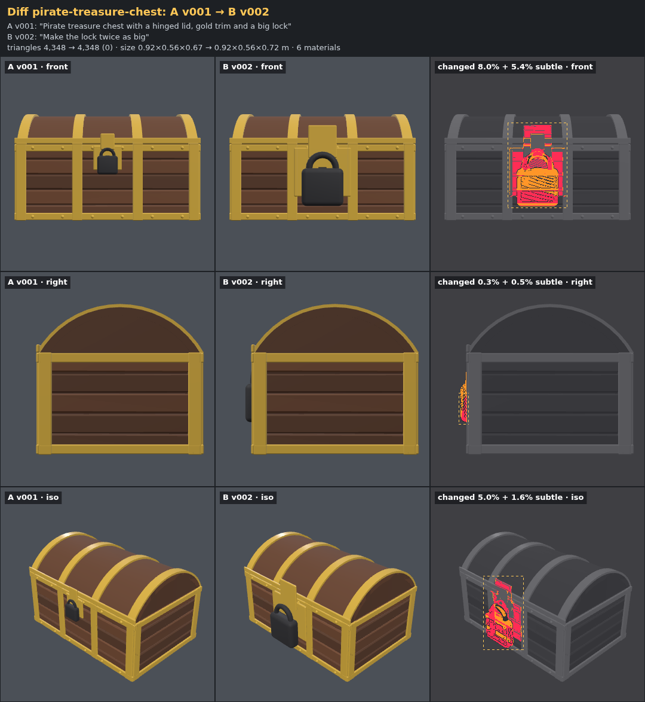
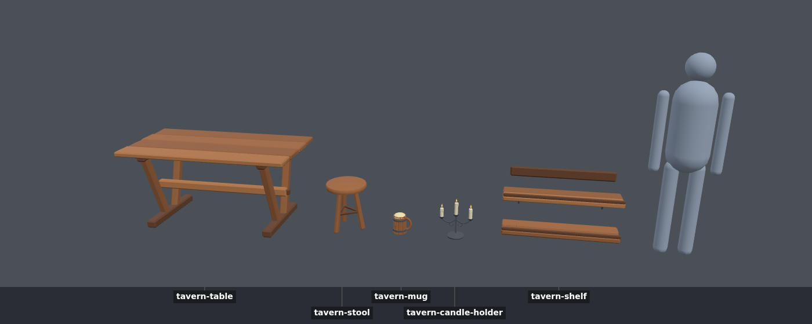
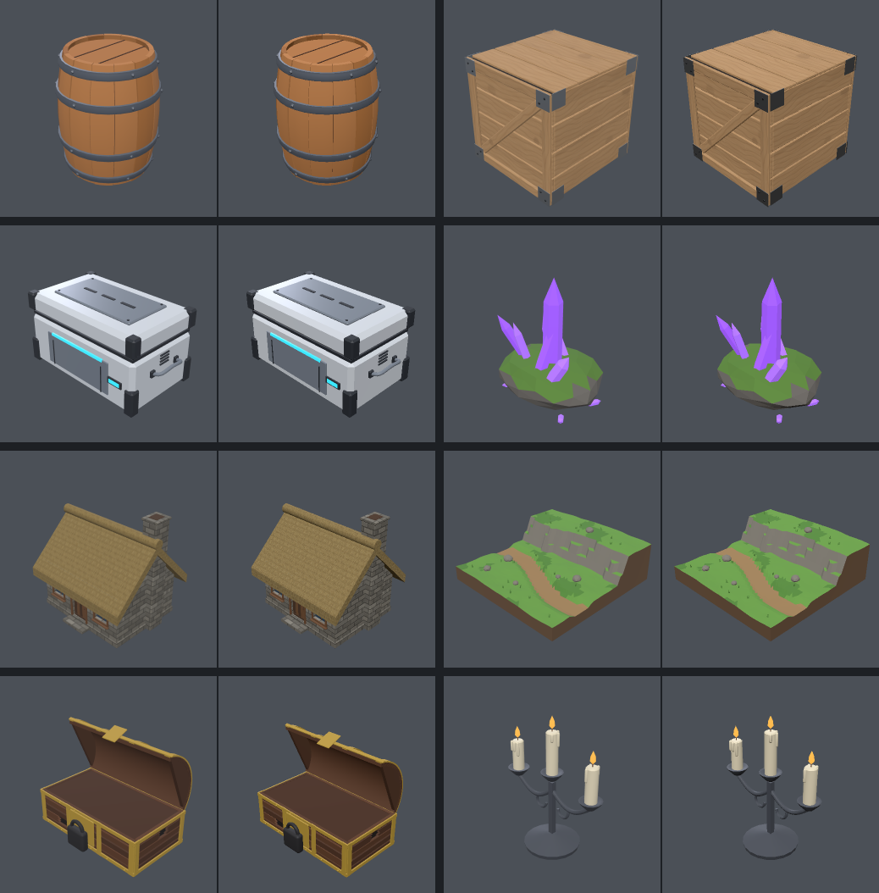

# AI 3D Asset Studio — User Guide

You describe a game asset in plain language. An AI coding agent (Claude Code, or any agent that
reads `AGENTS.md`) writes it as procedural Three.js code. You watch it appear in a live viewport
and ask for changes. When it is right, you export a GLB that looks the same in **Godot** and
**Roblox Studio**.

**Prompt → Generate → Preview → Revise → Export**



---

## Contents

1. [Install](#1-install)
2. [Quick start: your first asset](#2-quick-start-your-first-asset)
3. [Talking to the agent](#3-talking-to-the-agent)
4. [The viewport](#4-the-viewport)
5. [Revisions, versions and undo](#5-revisions-versions-and-undo)
6. [Sets and variants](#6-sets-and-variants)
7. [Quality checks: what they mean](#7-quality-checks-what-they-mean)
8. [Exporting to Godot, Roblox Studio and others](#8-exporting-to-godot-roblox-studio-and-others)
9. [Making good environments, houses and nature (the essentials)](#9-making-good-environments-houses-and-nature-the-essentials)
10. [Golden set and engine tests](#10-golden-set-and-engine-tests)
11. [CLI reference](#11-cli-reference)
12. [Project structure](#12-project-structure)
13. [Customizing: rules, profiles, settings, new engines](#13-customizing-rules-profiles-settings-new-engines)
14. [Limitations](#14-limitations)
15. [Troubleshooting](#15-troubleshooting)
16. [FAQ](#16-faq)
17. [What has been verified, and where](#17-what-has-been-verified-and-where)

---

## 1. Install

Requirements:

- **Node.js 20.11+** (22 LTS recommended) and git.
- **Chromium for headless renders** (review sheets, parity, diffs, golden tests). Playwright
  installs the exact build the studio expects.
- **Claude Code** (or another coding agent) to create the assets.
- Optional: **Godot 4.3+** for the automatic Godot check, and **Roblox Studio** for the manual
  Roblox check.

```bash
git clone <this repo> && cd 3d-generator
npm install
npx playwright install chromium        # Linux: npx playwright install --with-deps chromium
node studio doctor                     # checks Node, packages, headless WebGL, folders, Godot
```

`doctor` should end with "All required checks passed".

## 2. Quick start: your first asset

Open two terminals in the repo:

```bash
# terminal 1: the live viewport (leave it running)
node studio dev            # → http://127.0.0.1:5178  (add --open to open the browser)

# terminal 2: the agent
claude
```

In Claude Code, type:

```
/asset A stylized wooden barrel with chunky iron hoops
```

The agent then works through these steps:

1. It states its interpretation in one or two sentences (style, real size, main parts).
2. It scaffolds `assets/stylized-barrel/asset.js` and writes the code.
3. It runs `node studio review stylized-barrel` and **looks at the rendered sheet** (front,
   side, back, top, iso, wireframe), checks it against the prompt and `rules/checklists/review.md`,
   and fixes what is wrong, usually in one to three rounds.
4. It saves a version with your words: `node studio save stylized-barrel -m "…"`.
5. It replies with what it built (size, parts, triangles), anything it could not do, and ideas
   for next revisions.

Meanwhile the viewport updates on every save. What you see is the exported GLB file, not a
preview approximation.

Then ask for changes in plain language: *"make the hoops thinner and add a lid handle"*. When
it looks right: *"/export stylized-barrel roblox"* (or `godot`, `generic`, `all`).

## 3. Talking to the agent

### Slash commands (Claude Code)

| Command | Use |
| --- | --- |
| `/asset <prompt>` | Create a new asset |
| `/revise <slug> <change>` | Change an existing asset (smallest change, verified with a visual diff) |
| `/variants <slug> <what>` | Add variants (sizes, colors, damage states, seeds) |
| `/set <prompt>` | A set of matching assets from one prompt |
| `/review <slug> [profile]` | A critical review with fixes |
| `/export <slug> <profile>` | Export for an engine |
| `/undo <slug>` | Go back one step |

Plain sentences work too: the agent follows `AGENTS.md` either way. Other agents (Cursor,
Codex, Aider…) can use the same workflow by reading `AGENTS.md`.

### Writing good prompts

The prompt decides the art: style, shapes, proportions, colors and level of detail. The rules
only make it well built.

- **Name the object and the style:** "low-poly", "stylized cartoon", "realistic", "sci-fi
  hard-surface", "medieval", "post-apocalyptic", "minimalist"…
- **Give a size or a reference** when it matters: "a 2 m tall street lamp", "a mug for a
  tavern table".
- **List the parts you care about:** "with a hinged lid, gold trim and a big lock".
- **Say what moves:** lids, doors and wheels become separate parts with a proper pivot.
- **Mention the engine** if you already know it: "for Roblox" makes the agent think in studs and
  texture budgets from the start.

Examples:

```
/asset A post-apocalyptic oil drum: rusty, dented, faded hazard stripes
/asset A low-poly pine tree, 3 m tall, for a cozy forest scene
/asset A modular castle wall segment, 4 m wide, with crenellations, for Roblox
/set Cozy fantasy tavern props: a trestle table, a stool, a wooden mug, a candle holder and a wall shelf
/variants stylized-barrel a small one and a broken one
```

If you ask for something procedural modeling does badly (realistic creatures, faces,
film-quality foliage), the agent says so and offers a strong alternative instead of faking it
(see [Limitations](#14-limitations)).

## 4. The viewport

`node studio dev` serves the viewport at http://127.0.0.1:5178. It only displays exported GLB
files, so it is also your export preview.

| Area | What it does |
| --- | --- |
| **Assets** (left) | Every asset, grouped by set, with status (green = clean, yellow = warnings, red = errors), variant count and triangles. |
| **Profile** | Generic glTF / Godot / Roblox Studio. Switching shows that profile's GLB (built on demand), e.g. the Roblox version in studs with baked colors. |
| **Light** | **Neutral** (default) is a plain gray environment with key and fill lights and no tone mapping: the parity reference, close to an engine's default look. **Showcase** adds reflections and filmic tone mapping. It looks nicer but is not a parity reference. |
| **View** | Shaded, normals, UV checker, and texel density: a checker where each square is 16 texels of the real texture. Even square sizes across the model mean consistent sharpness; big squares mean blurry areas. |
| **Wire / Backfaces** | Wireframe overlay; back faces in red (missing or inverted faces show up as red from outside). |
| **Grid / Dims / Human** | 1 m grid, dimensions in m (and studs on the Roblox profile), and a 1.75 m human for scale. |
| **Front / Side / Top / 3/4** | Camera presets. Drag to orbit, right-drag to pan, wheel to zoom. |
| **PNG** | Saves a screenshot. |
| **Variant bar** (bottom) | Switch between the base asset and its variants. |
| **Report** tab | Size, triangles vs budget, meshes, materials with swatches, textures, the engine conversions the profile made, and import hints. |
| **Issues** tab | Validator issues with fix hints. |
| **UV** tab | Each texture at export resolution with the UV wireframe on top. Padding violations are circled in red. Shows texel density and minimum padding. |
| **Versions** tab | Saved versions with thumbnails. Click one to preview it read-only. Each row shows the command that restores it. |

The viewport reloads by itself when the agent saves code or runs a CLI build, and it keeps your
camera.

## 5. Revisions, versions and undo

Every request the agent completes is saved as a version with your words:

```bash
node studio history pirate-treasure-chest
  v001  2026-10-01 20:50    4,348△  "Pirate treasure chest with a hinged lid, gold trim and a big lock"
  v002  2026-10-01 20:51    4,348△  "Make the lock twice as big"
  v003  2026-10-01 20:51    4,348△  "Make the chest wider and lower"
● v004  2026-10-01 20:53    4,164△  "Add wear and damage"
```

| Command | Effect |
| --- | --- |
| `node studio diff <slug>` | Your unsaved changes vs the last saved version. With no unsaved changes: the current version vs the one before it. |
| `node studio diff <slug> v002 v004` | Two versions (`working` names the working copy). |
| `node studio undo <slug>` | One step back. Run it again to keep going back. |
| `node studio revert <slug> v002` | Restore any version. |
| `node studio pin <slug> v002` / `unpin` | Pinned versions are never pruned (history keeps the last 20 + pinned). |

Nothing is ever lost: `undo` and `revert` first save unsaved work as an `auto` version.

**Reading a diff sheet.** Rows are views, and columns are A | B | changes. Both files are
rendered with the same camera. **Red** marks shape or strong color changes; **orange** marks
subtle color or shading shifts; a dashed box surrounds the red area. After "make the lock twice
as big", only the lock should be red. After "add wear", orange covers the worn surfaces and red
marks the broken planks.



How the agent revises: it finds the param or part your request touches, makes the smallest
change (a new param if needed, e.g. `damage`), keeps the seeds, checks the diff, reviews, then
saves. It never rebuilds the asset from scratch for a revision. See
[docs/demos/phase4.md](demos/phase4.md).

## 6. Sets and variants

**Variants** are versions of one asset that differ in params or seed: sizes, colors, states
(open/closed, broken), or random shapes (trees, rocks). Each exports as `<slug>--<variant>.glb`.
`review` renders all variants plus a lineup.

**Sets** are several assets from one prompt that share a style module (`sets/<set>/style.js`:
palette, materials, bevel sizes, shared dimensions such as table and seat height, and helper
functions). The lineup review checks that they match and fit together at true scale.

```bash
node studio review set:tavern            # every member + a lineup image
node studio export set:tavern --profile roblox
node studio save set:tavern -m "…"       # one version for the whole set
```



## 7. Quality checks: what they mean

Every build is validated on the final engine file. **Errors block export**. Warnings are
explained in the report. The full list, with a fix for each id, is in
`rules/07-export-hygiene.md`.

| Check | Why it matters |
| --- | --- |
| **UV island padding** (`uv.padding`) | Texture islands closer than N pixels bleed colors into each other when the engine shrinks the texture (mipmaps, Roblox downscaling): dirty seams at a distance. Measured in texels **at the final texture size**. Roblox needs ≥ 8 px; others ≥ 4 px. The exporter also dilates edge colors into the gutters. |
| **Texture size** (`texture.too-large`, `texture.large`) | Roblox caps maps at 1024 px. The Roblox profile downscales **before** you see it, so the preview is what Roblox shows. |
| **Texel density** (`texture.low-density`, `texture.density-mismatch`) | Pixels per meter on the model. Too low looks blurry. Roblox: ≥ 90 px/m (error below), 180 target. Generic/Godot: ≥ 128. Mixing very different densities on one asset looks inconsistent. |
| **Triangles** (`scene.mesh-triangles`, `scene.triangle-budget`) | Roblox rejects meshes over 20,000 triangles. The profile first splits big meshes by connected pieces. A single piece over the limit is an error (or decimated with `--allow-decimate`). The asset's own budget (`meta.budget`) gives a warning. |
| **Geometry** | Inverted or inside-out faces, degenerate or duplicate triangles, bad normals, NaN. |
| **Materials** | Only portable PBR; metalness 0 or 1; albedo in a sane range; polished metal that turns black without reflections; emissive on Roblox (unverified). |
| **Scene** | Origin at the base center, plausible size for the category, mesh count, materials per mesh. |
| **Parity** | `review` renders the original scene and the exported GLB from the same cameras. A difference means the export changed something (open `parity/` to see source, GLB and diff). |
| **Source lint** | `Math.random`, `Date`, Node APIs, double-sided or negative-scale tricks in asset code. |

## 8. Exporting to Godot, Roblox Studio and others

```bash
node studio export pirate-treasure-chest --profile roblox      # or godot | generic | all
```

The export is written to `exports/<profile>/<slug>.glb`, with `.report.json` and `.report.md`
(size, meshes, materials, textures with density and padding, conversions, issues, import steps).
Export refuses to write while errors remain, and it checks that a fresh rebuild reproduces the
preview byte for byte.

### Godot 4

1. Copy `exports/godot/<asset>.glb` into your project (FileSystem dock).
2. The default import settings work: 1 unit = 1 m, +Y up, the asset faces +Z, and the origin is
   at the base center. Materials become StandardMaterial3D.
3. Separate parts (lids, doors) are child nodes with their pivot on the hinge. Rotate them
   directly.
4. Tip: Godot compresses 3D textures with VRAM compression by default. For pixel-exact palettes
   or crisp detail, set the texture import to Lossless.
5. Runtime loading: `GLTFDocument.append_from_file()` + `generate_scene()`.

Godot is verified automatically: `node studio engine-verify godot` (38/38 golden items on Godot
4.7.2; see section 10).

### Roblox Studio

1. `node studio export <asset> --profile roblox`.
2. In Studio: **File > Import 3D** (or Home/Avatar > Import 3D) and pick the `.glb`.
3. **Scale Unit: Stud**, which is the default. The file is already in studs (25:7 studs per
   meter). Do not choose Meter.
4. Each material becomes a MeshPart. Flat colors share one palette texture, so a stylized asset
   is often a single MeshPart. Separate parts are separate MeshParts.
5. Colors live in textures, because the Roblox glTF importer ignores color factors. You must be
   signed in so Studio can upload the images.

What the Roblox profile does for you: studs, baked colors, a palette atlas, one material per
mesh, repeats baked into 0..1 UVs, textures ≤ 1024 px, a 20k-triangle split, gutter dilation and
emissive clamping. The preview shows the result.

### Generic glTF (Blender, Unity, Unreal, three.js…)

`--profile generic` is standard glTF 2.0 with PBR metallic-roughness, PNG textures and tangents.

- Blender: File > Import > glTF 2.0.
- Unity: install glTFast and drop the file into Assets.
- Unreal Engine 5: drag it into the Content Browser (Interchange).

Generic exports are not verified per engine; a dedicated profile can be added
([section 13](#13-customizing-rules-profiles-settings-new-engines)).

## 9. Making good environments, houses and nature (the essentials)

The agent follows `rules/12-environments-and-terrain.md`, `rules/13-buildings-and-houses.md`
and `rules/14-nature-rocks-vegetation.md`. These are the core ideas, so you know what to ask
for and what to expect.

### Environments and terrain

Build **pieces that drop into a level**: diorama tiles, snap-together ground tiles, cliff
modules, rock and tree sets, path pieces. Huge open landscapes belong in the engine's terrain
tools (Roblox Terrain, Godot terrain plugins); these pieces dress them.

| Piece | Typical size |
| --- | --- |
| Diorama / showcase tile | 6–10 m square, closed sides ("skirt") |
| Snap-together ground tile | 4, 8 or 16 m (Roblox: 16/32/64 studs), border height kept constant so tiles meet |
| Cliff module | 4–8 m wide, 2–6 m tall, flat back and sides |
| Path piece | 2–4 m wide, slightly sunken, gentle cross-slope |

What makes terrain look good:

1. **One or two big ideas first:** a rise, a cliff band, a basin. Noise is seasoning (0.2–0.6 m
   on an 8 m tile). High-frequency noise looks like crumpled paper.
2. **Slope decides the surface:** above about 30–35° is rock or cliff, below 25° holds grass,
   paths and props. Use height bands for sand near water and snow on peaks.
3. **Color variety from large, soft patches** (two grass tones), never per-face randomness.
4. **Dress with rules:** rocks on flats and at cliff feet, trees on gentle slopes, nothing on
   paths. Cluster (one big rock + two or three small), sink rocks 30–40 % into the ground, and
   leave clearings.
5. **Composition:** a focal point, a path leading to it, low/mid/tall elements, calm areas.
6. **Budget:** an 8 m tile ≈ 2–5k triangles. On Roblox, prefer flat colors or several small
   tiles over one huge textured mesh (≈ 8 m per 1024 px texture keeps 90+ px/m).

Prompt example:

```
/asset An 8 m stylized meadow diorama tile: a dirt path curving through grass, a rocky cliff
band at the back, a few rocks and grass tufts, closed soil sides
```

### Houses and buildings

Buildings are read against the player, so human scale is non-negotiable:

| Element | Size |
| --- | --- |
| Wall height per floor | 2.6–3.0 m |
| Exterior wall thickness | 0.25–0.4 m (stone/timber looks thicker: 0.35–0.6) |
| Door | 0.9–1.0 × 2.0–2.1 m |
| Window | 0.6–1.2 wide, 0.8–1.4 tall, sill at 0.8–1.0 m |
| Roof pitch | 30–45° (thatch 45–55°), overhang 0.3–0.6 m |
| Plinth | 0.2–0.5 m high, slightly wider than the wall |
| Stairs | riser 0.18, tread 0.28 |

What makes houses look good:

1. **Plan first:** footprint, floors, wall height, roof type, openings.
2. **Walls with real thickness** and clean openings (`k.arch.wall`), at least 0.3 m of wall
   between openings and corners, window tops aligned with the door top.
3. **Openings need depth:** frames stick out 3–8 cm, glass and doors sit 5–15 cm back. That
   shadow line is what makes a window read.
4. **The roof makes the silhouette:** always give it thickness and overhang, plus a ridge cap or
   tiles; chimneys go 0.6–1 m above the ridge. Thatch is thick, with straw running down the slope.
5. **Material zones bottom to top:** darker plinth → walls → wood trims → roof, separated by
   value. Dirt gathers at the bottom and under the eaves.
6. **Modular kits** use one grid (2 or 4 m; Roblox 8/16 studs), consistent origins, ends cut
   flat, and the variants a builder needs: straight, corner, end, door, window.
7. **Budget:** a small house is 2–12k triangles. On Roblox, keep wall textures at ≥ 90 px/m.

```
/asset A small stone cottage, 5 × 4 m, one floor, thatched gable roof, wooden door, two
windows with frames, a chimney, cozy stylized look
```

### Nature: rocks, trees, plants

- **Rocks:** flat bottoms sunk into the ground, squashed wider than tall for boulders; sets
  beat singles (seed variants, sizes 1 : 0.5 : 0.25); moss or snow on upward faces.
- **Trees:** silhouette first. Conifer = stacked cones; broadleaf = trunk + 3–7 overlapping
  blobs; palm = curved trunk + leaf cards. Taper the trunk, add a slight lean, use 2–3 greens of
  one hue family (darker inside, lighter on top). A forest comes from one asset with seed and
  height variants.
- **Bushes and grass:** a few overlapping squashed blobs; many small grass tufts beat a few big
  ones; flowers are accents. Leaf cards use alpha *mask* (never blend) with a back face.
- **Budgets:** rock 50–800 triangles, low-poly tree 60–400, stylized tree 400–2,000, bush
  100–600. Scatter multiplies, so count instances × triangles.

```
/asset A low-poly pine tree, 3 m tall, cozy palette
/variants lowpoly-pine-tree two more seeds, one shorter and one taller
```

## 10. Golden set and engine tests

These are for maintainers: run them when you change the kit, the exporter, a profile or a golden
asset.

```bash
node studio golden                         # 38 items × 3 profiles, ~2 minutes
open golden/report/index.html              # checks + baseline/current/diff images
node studio golden --update-baselines      # approve an intentional visual change (then commit)
```

Each item must pass five checks: validate (0 errors, allowed warnings only), determinism (a fresh
build equals the preview), structure (matches `golden/manifest.json`), regression (renders match
the committed baselines) and parity (source vs GLB).

**Godot (automatic):**

```bash
node studio engine-verify godot            # needs Godot 4.3+ (PATH or GODOT_BIN)
node studio engine-verify godot --capture  # + renders every item in Godot next to the studio view
```



**Roblox Studio (manual, about 15 minutes):** `node studio engine-pack roblox`, then follow
[engines/roblox/CHECKLIST.md](../engines/roblox/CHECKLIST.md): open the generated place, import
the GLBs into `GoldenImports`, press Play, and read PASS/FAIL per item.

`node studio stats` shows the PRD success metrics: time from prompt to first GLB, the engine
pass rates and revisions per asset.

## 11. CLI reference

All commands accept `--help` and most accept `--json`. Targets are `<slug>`, `<slug>--<variant>`
(where noted), `set:<name>` or `--all`.

| Command | Purpose |
| --- | --- |
| `dev [--port n] [--open]` | Live viewport with file watching and auto rebuild |
| `new <slug> --prompt "…" [--category c] [--style a,b] [--set s]` | Scaffold an asset |
| `new-set <set> --members a,b,c --prompt "…" [--style a,b]` | Scaffold a set + members |
| `build <target> [--profile p\|all] [--variant v] [--force] [--strict] [--allow-decimate]` | Build preview GLBs and validate |
| `validate <target> --profile p` | Preflight only |
| `review <target> [--profile p] [--views …] [--size px] [--no-parity]` | Contact sheets + parity + lineups |
| `compare <a> <b> [--views …] [--out file]` | A/B side-by-side render |
| `save <target> -m "…" [--pin] [--force] [--no-thumb]` | Save a version |
| `history <target>` | List versions |
| `diff <target> [vA] [vB] [--views …] [--out file]` | Visual + stats + source diff |
| `undo <target>` / `revert <target> <vNNN>` | Go back (auto-saves unsaved work) |
| `pin <target> <vNNN>` / `unpin …` | Protect a version from pruning |
| `export <target> --profile p\|all [--no-parity]` | Strict export to `exports/` |
| `report <slug[--variant]> [--profile p] [--export] [--md]` | Full build or export report |
| `list` | Assets and sets |
| `stats` | Project statistics and success metrics |
| `golden [--profile p] [--only a,b] [--update-baselines]` | Golden suite |
| `engine-pack godot\|roblox\|all [--variants\|--no-variants]` | Prepare engine checks |
| `engine-verify godot [--no-pack] [--capture]` | Run the Godot check |
| `doctor` | Environment check |

## 12. Project structure

```
assets/<slug>/asset.js      your assets (the only place asset code lives)
sets/<set>/                 set.json + style.js shared by set members
rules/                      modeling knowledge the agent reads (01–14 + review checklist)
AGENTS.md, CLAUDE.md        the agent workflow; .claude/commands/ = slash commands
studio/                     the tool: kit, exporter, validator, viewport, CLI (don't edit while making assets)
studio/profiles/*.json      engine profiles (limits, policies, import hints)
golden/                     golden set, manifest, baselines (report/ is generated)
engines/godot, engines/roblox   engine check projects/scripts
exports/                    exported engine files (generated, gitignored)
.studio/                    local state: previews, history, shots, metrics (gitignored)
docs/                       this guide, KIT.md, ARCHITECTURE.md, DECISIONS.md, demos/
tests/                      npm test
```

## 13. Customizing: rules, profiles, settings, new engines

- **Rules** (`rules/*.md`) are plain Markdown, so edit them to teach the agent your studio's
  standards (proportions, palettes, budgets). Keep them about craft, not style: the prompt must
  still decide the art.
- **Settings** (`studio.config.json`): default profile, server port, number of history versions
  kept, review views and size, parity thresholds, golden regression threshold.
- **Engine profiles** (`studio/profiles/*.json`): units, axes, triangle limits, texture limits,
  texel density targets, UV padding, material policy (bake factors, palette atlas, materials per
  mesh, alpha modes, emissive), UV policy (0..1, tile bake) and import hints. Change a limit, then
  run `node studio golden`.
- **Adding an engine profile** (e.g. Unity or Unreal): copy `generic.json` to `unity.json`, set
  `id`, `label`, limits and import hints, add it to `golden/golden.json` → `profiles`, run
  `node studio golden --profile unity --update-baselines`, and verify a few imports by hand (or
  script it like `engines/godot`). The new profile appears in the viewport and the CLI
  automatically.

## 14. Limitations

Procedural code is strong at props, hard-surface objects, furniture, architecture, modular kits,
environment pieces and stylized objects. It is weak at:

- realistic organic characters and creatures (faces, anatomy, cloth)
- dense realistic foliage, hair and fur
- rigging and animation (out of scope for V1)
- scan-like realism

The agent will say so and offer a strong alternative (stylized or low-poly figures, statues,
toys). Large landscapes belong in the engine's terrain tools; the studio makes the pieces.

## 15. Troubleshooting

| Problem | Fix |
| --- | --- |
| `Could not start Chromium for headless renders` | `npx playwright install chromium` (Linux: add `--with-deps`), or set `STUDIO_CHROMIUM` to a Chrome binary. |
| The viewport doesn't update | Is `node studio dev` running? Check its terminal for build errors; the status bar shows the last build. |
| Build error in the asset | The CLI prints the message, a fix hint and the line in your asset. The viewport shows a red banner. |
| Export blocked | Fix the listed errors (the fix guide per id is in `rules/07-export-hygiene.md`). Checks are never switched off. |
| Golden regression after a kit change | Open `golden/report/index.html`. If the change is intended, run `--update-baselines` and commit; otherwise fix the code. |
| Roblox model is huge or tiny | Scale Unit must be **Stud** when importing. |
| Roblox parts are white | Textures did not upload: sign in to Studio, then re-import. |
| Godot not found | Put Godot 4.3+ on PATH as `godot`, or set `GODOT_BIN`. |
| Port 5178 in use | `node studio dev --port 5180`. |

## 16. FAQ

**Is the viewport a separate renderer that might differ from the export?** No. It only loads
the exported GLB. `export` verifies that the file it writes equals the preview byte for byte.

**Does the asset look identical in every engine?** Shape, proportions, scale, pivot, UVs, colors
and textures match (Godot is verified automatically). Lighting differs between renderers; that
is expected and is not what parity means.

**Can I edit an asset by hand?** Yes. It is plain JavaScript in `assets/<slug>/asset.js`.
Change a param and the viewport reloads. Save a version afterwards (`node studio save`).

**Where do my exports go, and are they committed?** `exports/<profile>/`. They are gitignored
because they are generated; commit the asset code instead.

**How many versions are kept?** The last 20 plus every pinned one, per asset or set
(configurable).

**Can it make several assets at once?** Yes: sets from one prompt (`/set`) and variants of one
asset (`/variants`). Arranging assets into a scene is out of scope.

## 17. What has been verified, and where

| Item | Status |
| --- | --- |
| All 21 demo assets (+ variants) build in all three profiles with 0 errors | ✔ verified (build + validator) |
| Golden suite: 114/114 checks (validate, determinism, structure, regression, parity) | ✔ verified, also in CI |
| Viewport live reload, panels, profile switching, UV overlay, versions panel | ✔ verified with Playwright screenshots |
| Godot 4.7.2: 38/38 golden items load with the expected size, triangles, pivots, materials; rendered side by side | ✔ verified headless (`engine-verify godot`), also in CI |
| Roblox Studio import of the golden set | ☐ **needs your machine**: `node studio engine-pack roblox` + [CHECKLIST.md](../engines/roblox/CHECKLIST.md) (Studio has no headless mode) |
| Roblox emissive and alpha-blend mapping | ☐ unverified, covered by the checklist |
| Unity / Unreal | ☐ generic GLB only; no dedicated profile yet |

More background: [ARCHITECTURE.md](ARCHITECTURE.md), [KIT.md](KIT.md),
[DECISIONS.md](DECISIONS.md), and the phase demos in [docs/demos/](demos/).
