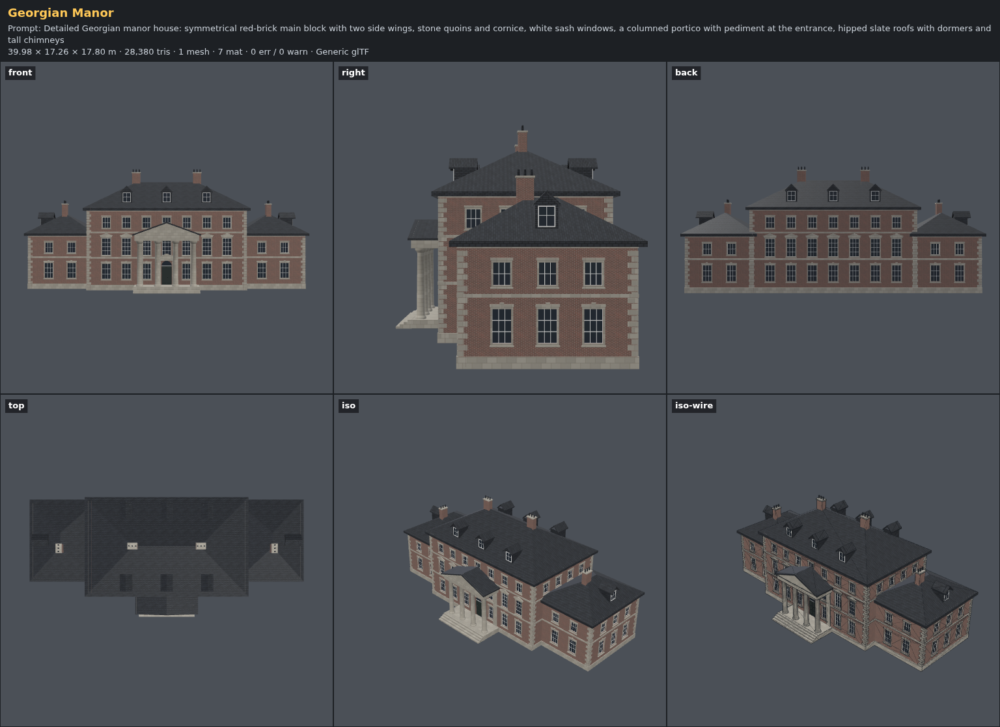
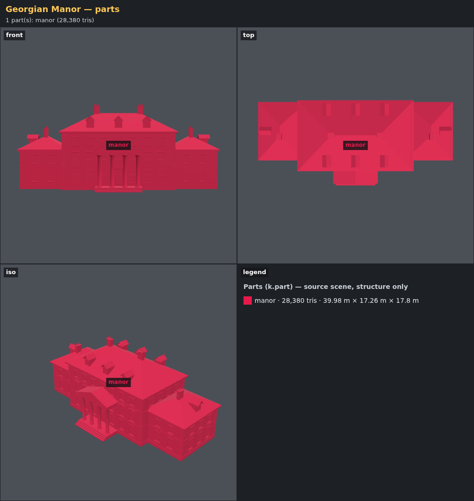
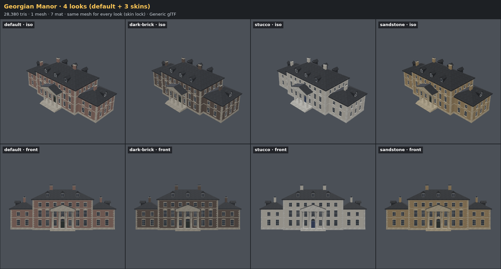
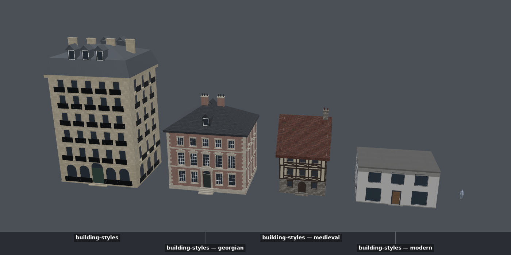
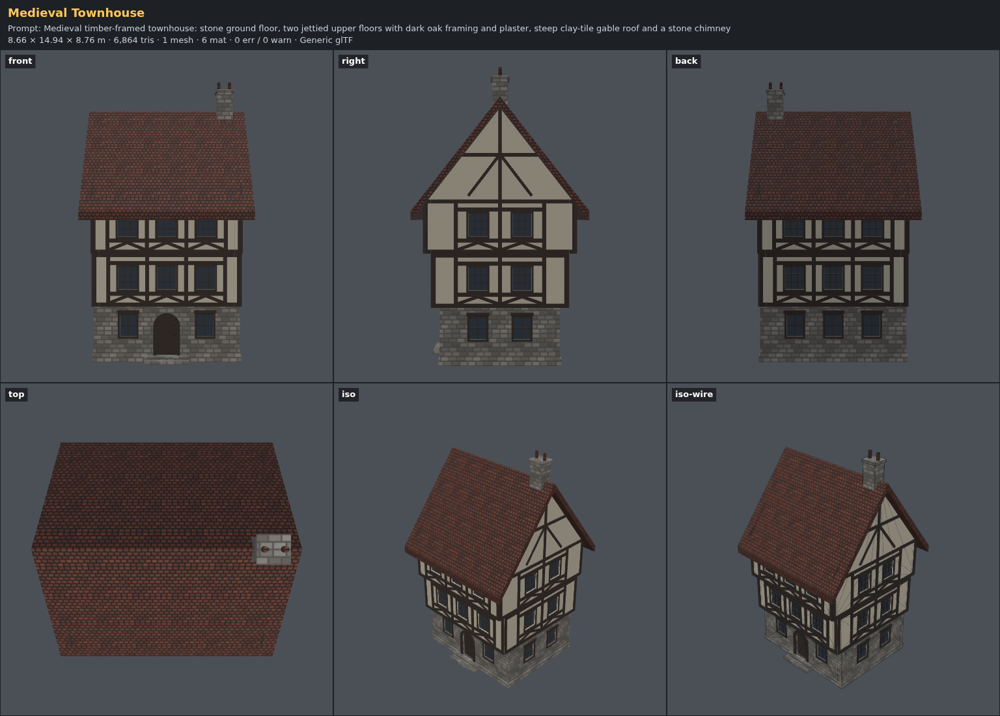
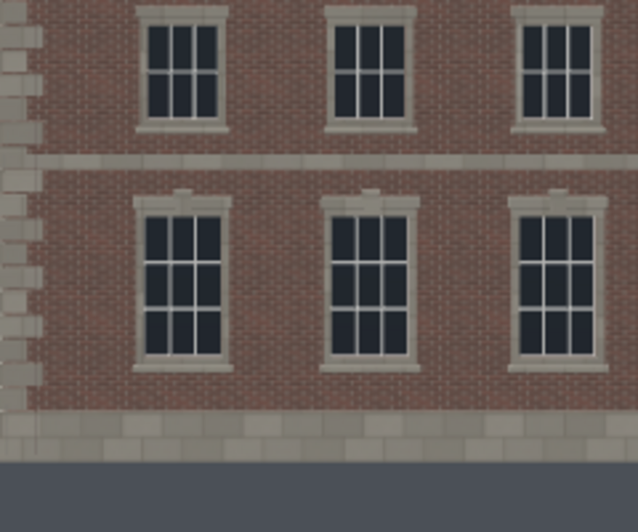

# Buildings demo — from a cottage to a manor

**Goal:** an agent that knows architecture: it describes a building as a plan (masses, floors,
bays, roof) in a style, and the kit builds detailed, engine-ready houses up to manor scale,
also from a photo of a house.

```
/asset Detailed Georgian manor house: symmetrical red-brick main block with two side wings, stone quoins and cornice, white sash windows, a columned portico with pediment at the entrance, hipped slate roofs with dormers and tall chimneys
```

## How it is built

`k.arch.building(spec)` turns a plan into a building in three steps with plain data in between
(`studio/kit/building.js`, styles as data in `studio/kit/building-styles.js`):

1. **plan:** masses (boxes) → 4 sides each → symmetric bays → a slot per bay × floor (door or
   window by floor role). Walls inside another mass get no windows, and no wall when the whole
   floor is covered; a lower wing leaves the main block's upper windows in place.
2. **build:** modules in each side's local frame: walls with openings, window frames, sills,
   heads (lintel, keystone, pediment, cornice), sash bars, shutters, balconies, door with fanlight,
   pilasters and steps, plinth, string courses, cornice, quoins, timber framing with gable
   timbers, jetties, roofs (gable, hip, mansard, shed, flat), dormers, chimneys, portico. One
   geometry per material zone; detail drops 2 → 1 → 0 until the triangle budget fits.
3. **materials:** tiling textures per zone (brick, ashlar, rubble, plaster, concrete, slate, clay
   tiles, thatch, zinc, timber, paint, glass, iron). Skins swap colors and finishes.

The manor asset is about 30 lines of plan: three masses, a portico and a few finish colors.



`parts.png` shows the single `manor` part (one mesh per material in the GLB):



| | |
| --- | --- |
| Size | 40.0 × 17.3 × 17.8 m (main block 22 × 13 m, three storeys; wings 9 × 11 m, two storeys) |
| Triangles | 28,380 at detail 2 (budget 60,000) |
| Materials | wall (brick), trim (ashlar), roof (slate), frame, glass, door, metal |
| Checks | 0 errors on Generic, Godot and Roblox |

## Skins

The finishes come from params, so one manor has four looks with the same mesh (skin lock):



## Styles

The same API in four styles (`assets/building-styles`, one variant per style):



| Style | Triangles |
| --- | --- |
| `paris-haussmann` (6 storeys, 15 × 12 m) | 22,848 |
| `georgian` (3 storeys) | 15,440 |
| `medieval-timber` (3 storeys, jettied) | 6,864 |
| `modern` (2 storeys) | 2,492 |

The medieval townhouse (`assets/medieval-townhouse`): stone ground floor, two jettied timber
floors with chevron braces, gable timbers, a steep tiled roof and an end chimney.



## Roblox: big walls stay sharp

Roblox needs UVs inside 0..1 and at least 90 px/m, and its textures stop at 1024 px. A 40 m
brick wall repeats its texture 34 × 20 times, too many to bake into one image. The Roblox profile
now cuts such surfaces on the texture grid and shifts each piece by whole repeats, so only 4 × 4
repeats are baked (`tile-bake` note: "wrapped into 4×4"). The texture still lines up across the
cuts:



It runs only when the plain bake would fail (more than 64 repeats, or below the minimum texel
density), so assets that already passed export exactly as before.


## From a photo

Rule 13 §10 teaches the agent to read a house photo before coding: masses, floors, bays per
side, roof type, chimneys, window heads, quoins, bands, timber, finishes. It picks the closest
style, overrides what differs (`style: { extends: 'georgian', … }`), saves the photo as
`reference.png` and fits widths, floor heights and roof pitch with the reference overlay.

## Not yet in the generator

Round or polygonal towers, bay windows and oriels, verandas, balustrades, curved or upturned
roofs (Chinese, Japanese), interiors. Agents build these by hand next to the building (rules 13
and 17) and say so.

## Tests

`tests/building.test.js`: symmetric bays and a centered door, wings hiding walls only on the
floors they reach, jetties, determinism, the budget lowering the detail level, every style
building, and the Roblox wrap (`fx-big-tiling`: 20 × 20 repeats exported with UVs in 0..1 and
≥ 90 px/m).
