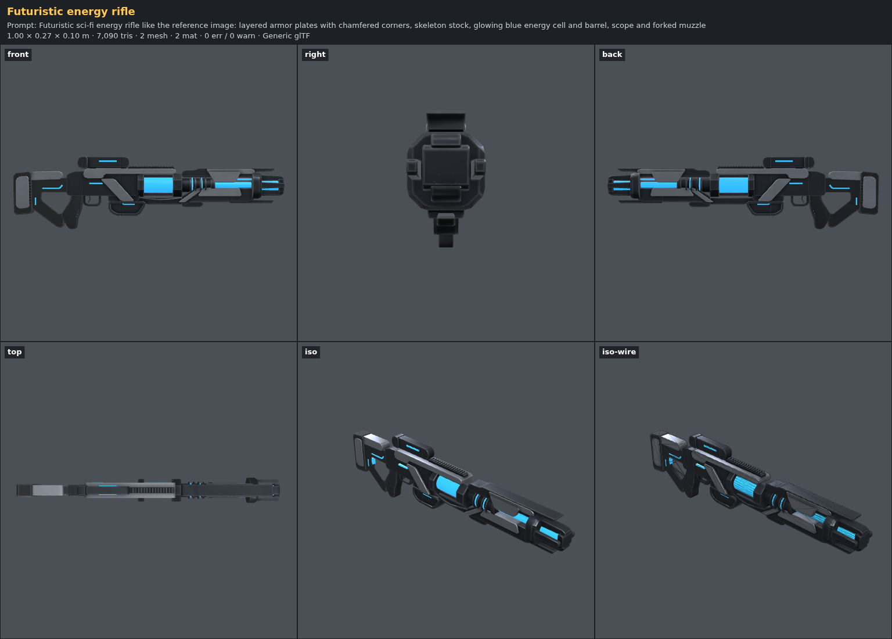
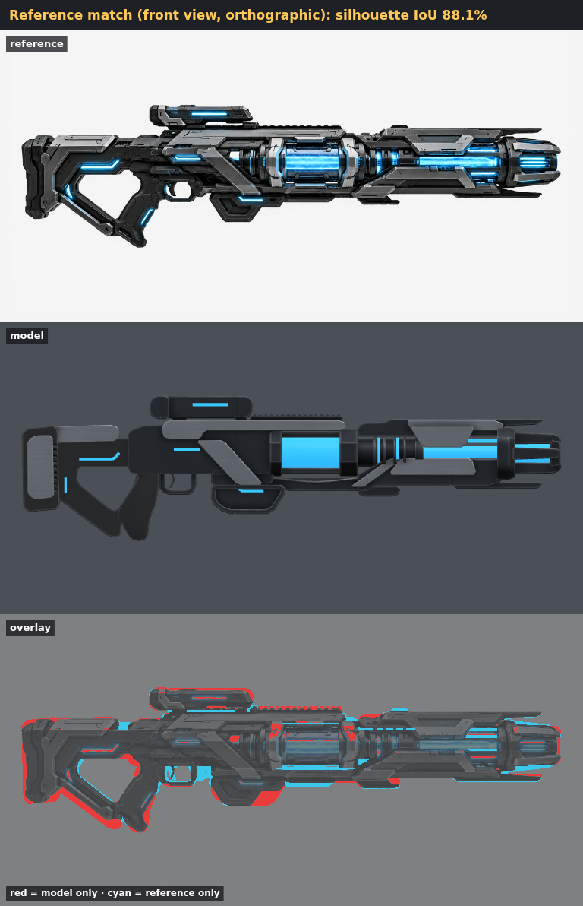
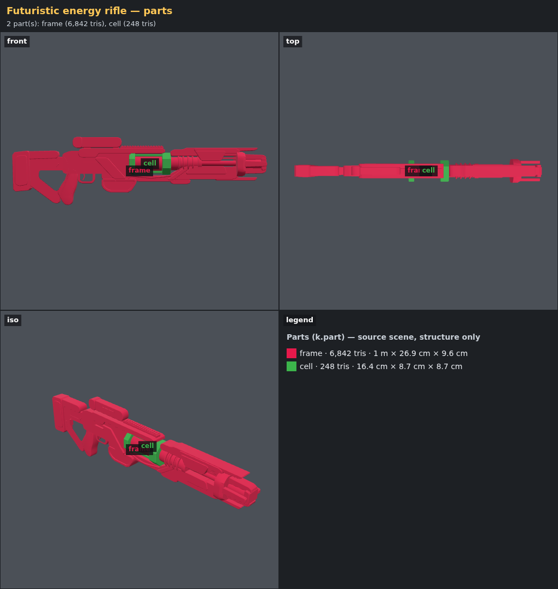
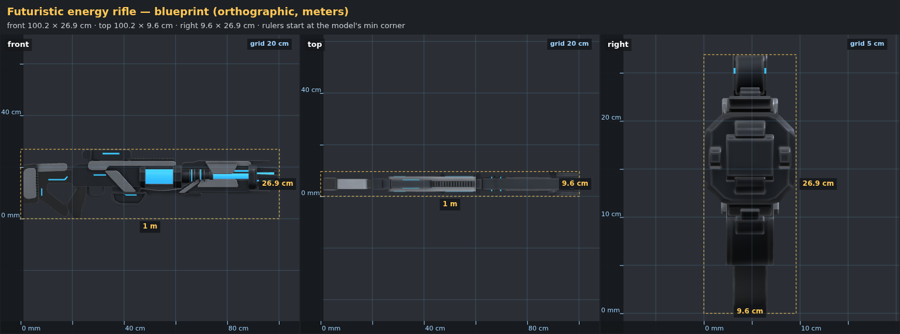
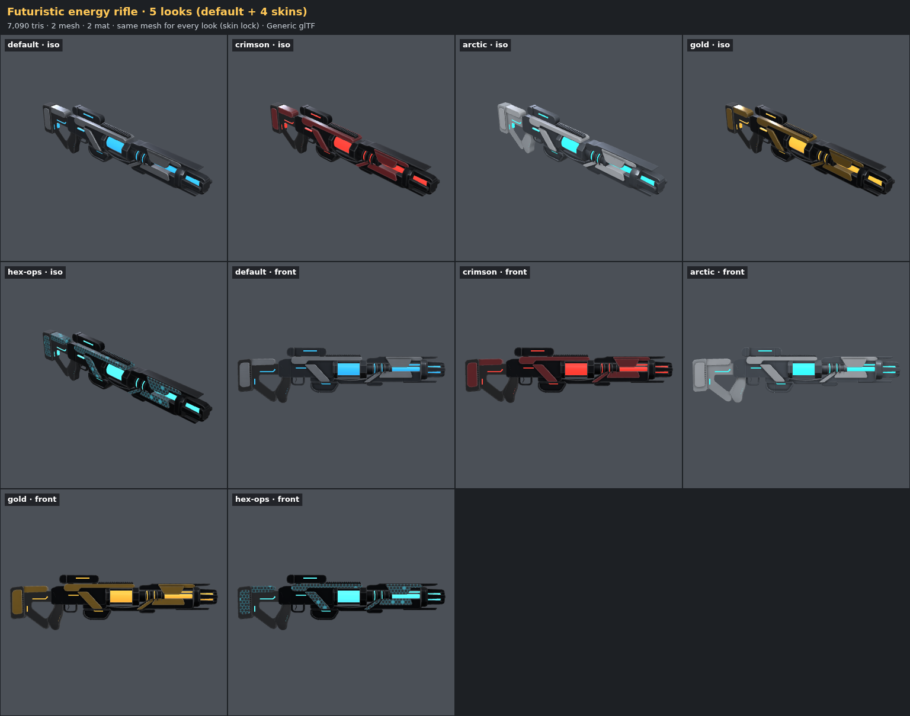

# Complex shapes demo — an energy rifle traced from a concept image

**Goal:** complex, designed shapes (sci-fi guns, vehicles, gadgets) that an agent can build and
check on its own, with a workflow that less capable agents can copy. The test case is a
concept image the user supplied, where another agent's attempt was "almost, but some parts are
stiff" (boxes instead of chamfered plates, flat rectangles instead of glow strips, a box and a
strut instead of a skeleton stock).

```
/asset Futuristic sci-fi energy rifle like the reference image: layered armor plates with chamfered corners, skeleton stock, glowing blue energy cell and barrel, scope and forked muzzle
```

## What was added

| | |
| --- | --- |
| **Shape language** (kit) | `k.shape.rounded` / `chamfered` (fillet or 45° cut per corner), `spline`, `polyline` (bands along a path), `offset` (insets); `k.geo.loft` (cross-sections), `k.geo.sweep` (section along a curve), `k.geo.dualProfile` (solid from two or three blueprint views). See [KIT.md](../KIT.md#2d-shapes). |
| **Feedback tools** (review) | `parts.png` (each `k.part` colored, with a legend), `blueprint.png` (orthographic views with a metric grid and rulers), `reference.png` (overlay on the user's picture with the silhouette IoU), `scene.floating-part` (pieces that touch nothing). |
| **Teaching** | [rule 17](../../rules/17-complex-shapes.md) (which tool per part, tracing with `px()`, why shapes look stiff, recipes for sci-fi, vehicles, products, instruments, the check loop) and this example asset. |

## The asset

`assets/energy-rifle`: 1.00 × 0.27 × 0.10 m, ~7.1k triangles, one 3D-painted atlas material +
one glow material, the energy cell as a separate part (pivot at its rear clamp), 4 skins. Every
outline is traced in reference pixels and converted with one helper, so the whole rifle scales
with `params.length`.



## Matching the reference

`meta.reference: { image: 'reference.png', view: 'front' }` makes every review write the overlay:
red = model only, cyan = reference only.



| Round | IoU | Fix |
| --- | --- | --- |
| 1 | 65 % | (overlay bug: shaded gray plates matched the gray background; the model mask now comes from a silhouette render) |
| 2 | 82 % | first real reading: stock opening filled, trigger guard opening covered by the receiver |
| 3 | 86 % | stock re-traced (upper bar + diagonal brace around the opening), receiver bottom raised, shroud extended |
| 4 | 88 % | lower beam under the energy cell, glow struts in front of the muzzle |

The remaining difference is mostly anti-aliased edges and small greebles.

## Parts and blueprint





## Skins

Same mesh, five looks (default, crimson, arctic, gold, hex-ops): the plates, body and polymer
are zones of one atlas painted in 3D; the glow material only changes color.



## Kit fixes found while building it

- `k.geo.loft` caps were wound against the side walls (caps faced inward); sections now also
  start at 12 o'clock, so a square flows into a circle without a 45° twist.
- `k.shape.offset` dropped nothing when a chamfer edge was shorter than the inset, leaving
  near-duplicate points (zero-length tangents); collapsing edges are now removed.
- `k.geo.dualProfile` removes CSG slivers. Chamfering both views still makes UV charts that
  touch, so rule 17 says to chamfer one view.

## Checks

- 0 errors on Generic, Godot and Roblox (Roblox: the usual `material.emissive` warning).
- Golden entries `energy-rifle` and `energy-rifle@crimson` on all three profiles.
- Tests: `tests/shapes.test.js` (chamfer geometry, fillet radius, collinear removal, polyline
  width, offset, spline, loft volume and winding, sweep along an S-curve, dualProfile bounds,
  floating parts) and `tests/review-tools.test.js` (parts view, blueprint dimensions, overlay
  IoU of a matching vs a squashed drawing).

## Limits

The tools are for designed, hard-surface and smooth product shapes. Organic sculpted forms
(faces, creatures, cloth, realistic trees) still need sculpting (rule 11).
