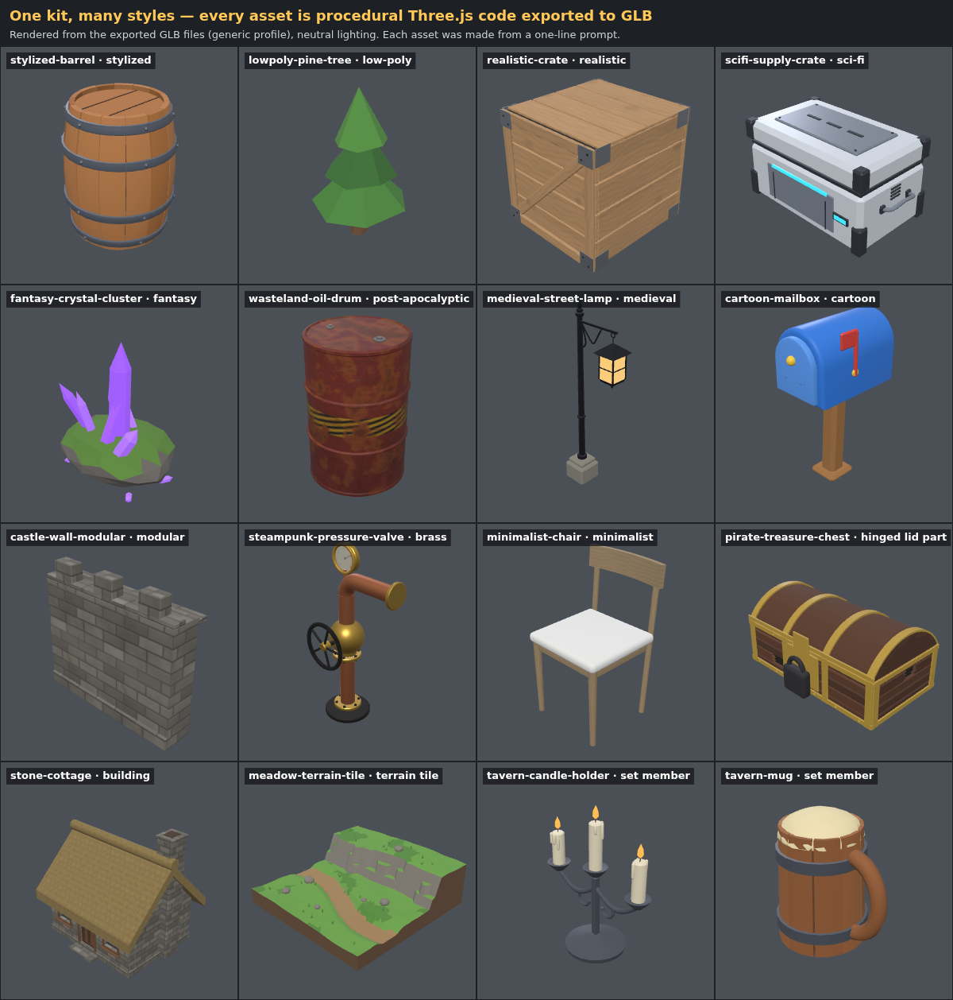
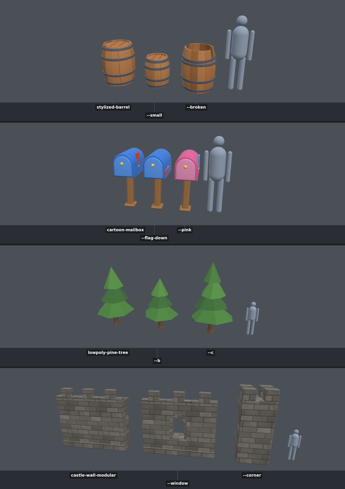

# Phase 2 demo — general prompt-to-3D creation

**Goal (PRD):** the agent turns creative briefs in any style into fitting geometry and materials,
not generic shapes. **Done when** ten prompts in different styles produce assets that clearly
follow their prompts, and all of them export.

## Twelve styles from one kit

Each asset below is one prompt turned into `assets/<slug>/asset.js` by the agent, reviewed from
its contact sheet, and exported. The renders come from the exported GLB files.

| Asset | Prompt (short) | What carries the style |
| --- | --- | --- |
| stylized-barrel | stylized wooden barrel, chunky iron hoops | bulge, thick hoops, big rivets, flat colors |
| lowpoly-pine-tree | low-poly pine | faceted stacked cones, 90 triangles, seed variants |
| realistic-crate | realistic wooden shipping crate | painted wood-grain texture, normal map from height, roughness variation |
| scifi-supply-crate | sci-fi supply crate | hard-surface panels, emissive strips |
| fantasy-crystal-cluster | fantasy crystal cluster | glowing prisms fanned from a mossy rock |
| wasteland-oil-drum | post-apocalyptic oil drum | rust, dents, hazard stripes |
| medieval-street-lamp | medieval street lamp | wrought-iron post, scroll bracket, lantern glass |
| cartoon-mailbox | cartoon mailbox | exaggerated rounded shapes, saturated colors |
| castle-wall-modular | modular castle wall | stone blocks texture, crenellations, snapping modules |
| steampunk-pressure-valve | steampunk pressure valve | brass and copper pipes, gauge, handwheel |
| minimalist-chair | minimalist chair | thin legs, clean planes, two materials |
| pirate-treasure-chest | pirate chest with hinged lid | separate lid part with its pivot on the hinge |

Two "core" environment pieces follow the dedicated rules `rules/12-environments-and-terrain.md`
and `rules/13-buildings-and-houses.md`: **stone-cottage** (walls with openings, a thatched
gable roof, plinth, chimney, at human scale) and **meadow-terrain-tile** (heightfield with a
path, a cliff band, painted grass/rock/dirt zones, scattered rocks).

## Multiple assets: sets and variants

**A set from one prompt.** "Cozy fantasy tavern props: a trestle table, a stool, a wooden mug,
a candle holder and a wall shelf" became `sets/tavern/` with a shared `style.js` (palette,
materials, bevel, shared dimensions, a plank helper) and five member assets. The lineup is at
true relative scale next to a 1.75 m human:

**Variants of one asset.** Named param or seed overrides, each exported as its own GLB
(`<slug>--<variant>.glb`):

## Everything exports

`node studio build --all --profile all` builds 120 GLBs (every asset and variant × generic,
Godot, Roblox) with **0 errors**. The only warnings are the expected ones: emissive on Roblox
(unverified mapping) and the deliberately rule-less A/B lantern.
