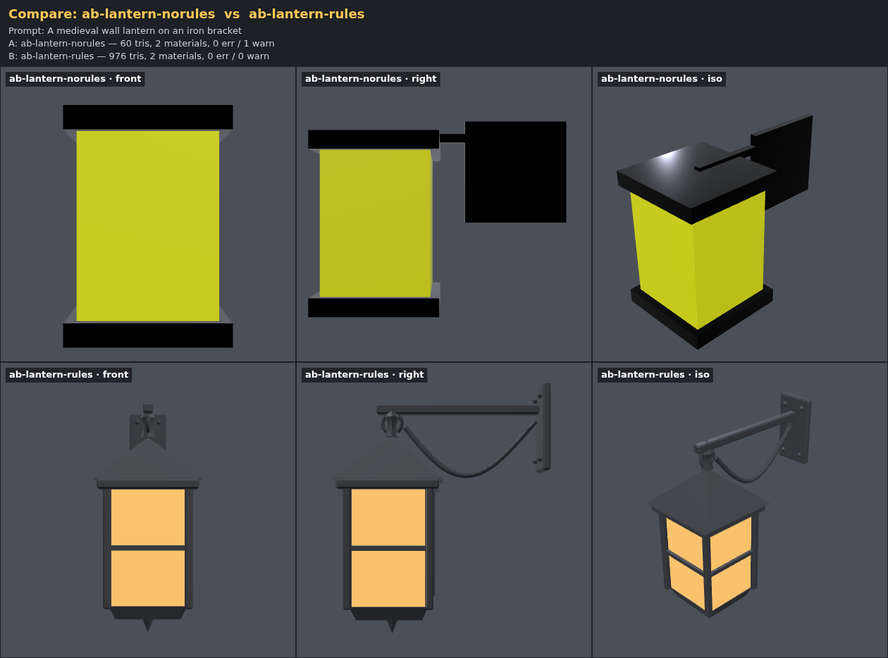
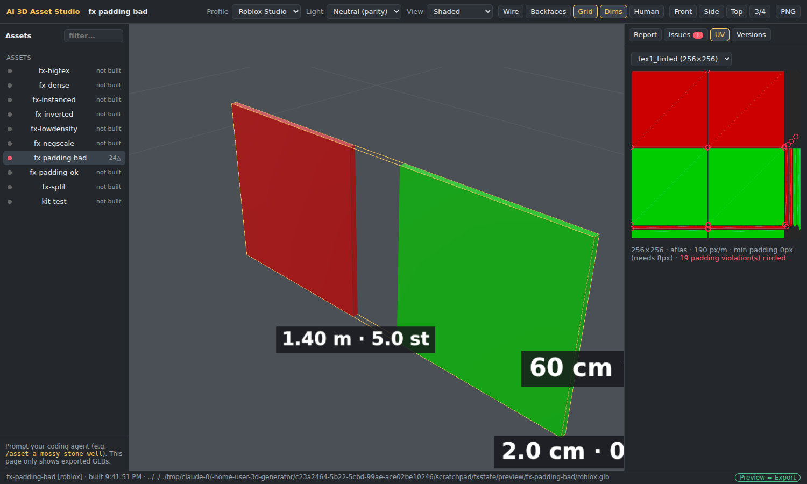
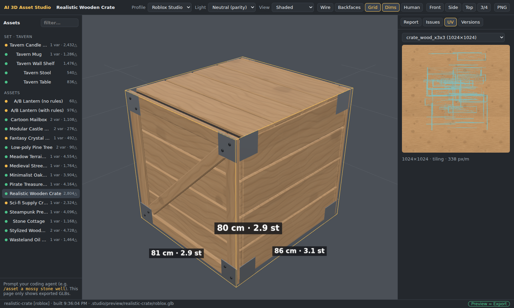

# Phase 3 demo — quality knowledge, modeling rules and engine gates

**Goal (PRD):** modeling guidance in the repo (shape language, silhouette, proportion, detail
hierarchy, materials, efficiency, structure, export hygiene) plus engine profiles. The prompt
still decides the art. **Done when** the same prompt made with the rules looks cleaner than
without them (side by side), and the engine profiles reject assets that break their limits.

## The rules

`rules/` holds the craft knowledge the agent reads before modeling, and never imposes a style:

| File | Topic |
| --- | --- |
| 01–03 | shape and silhouette, proportion and real-world scale, detail hierarchy and edges |
| 04–05 | PBR materials and textures (texel density, UV padding), topology and budgets |
| 06–07 | parts, pivots and merging, export hygiene with a fix for every validator issue id |
| 08–11 | style recipes (techniques, not defaults), sets and variants, revisions, limitations |
| 12–14 | the core environment guides: terrain and environments, buildings and houses, nature |
| checklists/review.md | what the agent checks on every review sheet |

## Same prompt, with and without rules

"A medieval wall lantern on an iron bracket". **A** was written without reading `rules/`, the way
a quick first attempt usually looks. **B** followed the workflow (rules + review sheet):

**A** is a box with a cap: no silhouette, pure black polished "iron" that renders dark without
reflections (the validator warns: `material.needs-reflections`), a flat yellow block for the
glass, and a plain slab for a bracket. **B** has a readable silhouette (pyramid roof, finial, scroll bracket, wall
plate), beveled frames with muntins, warm glass set back behind the frame, painted-metal values
that read in any lighting, and a sensible 976 triangles. To repeat the experiment with a fresh
agent session, give both sessions the same prompt and tell one of them not to read `rules/`.

## Engine profiles reject what breaks the engine

`studio/profiles/roblox.json` encodes the Roblox Studio limits. The user asked that UV island
padding, texture size and triangle count be checked **before** export, so Roblox results never
come out degraded:

| Limit | Generic | Roblox |
| --- | --- | --- |
| triangles per mesh | warn > 100k | **error > 20k** (auto-split by connected pieces first) |
| texture size | 4096 | **1024** (the preview shows the downscaled result) |
| UV island padding (atlas textures) | 4 px | **8 px at the final size** |
| texel density | ≥ 128 px/m | **≥ 90 px/m** (blurry below) |
| colors | factors | **baked into textures** (the importer ignores `baseColorFactor`) |
| materials per mesh | many | **one** (flat colors merged into a palette texture) |

The validator measures UV padding from the actual UV islands, rasterized at the final texture
size. Violations are circled in the viewport's UV panel:

With the Roblox profile, texture repeats are baked into a 0..1 texture (`crate_wood_x3x3`),
downscaled to 1024 px, and the resulting texel density is reported (338 px/m here):

Test fixtures prove the gates (`tests/validate.test.js`, `tests/export.test.js`): a single
30k-triangle piece and 2 px UV gutters **block** Roblox export, while 14 px gutters pass and a
model made of 3 × 10k pieces is split into meshes under the limit. Inverted winding is an error,
negative scale is baked with fixed winding, low texel density blocks Roblox, and big repeating
textures are tile-baked into 0..1 UVs at ≤ 1024 px.
