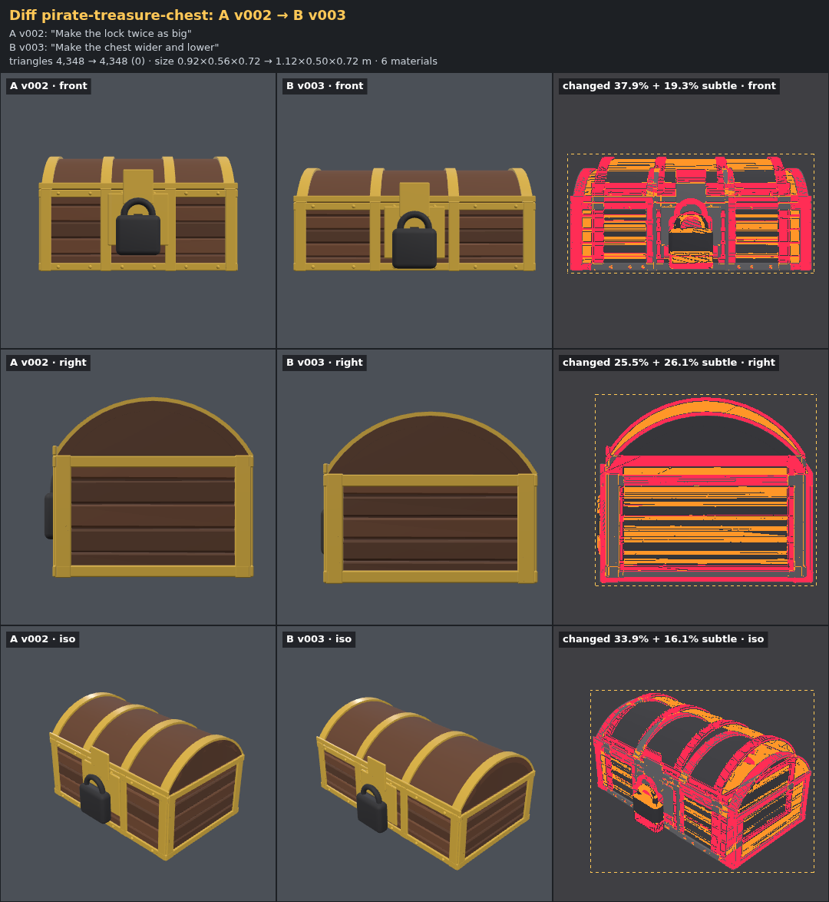
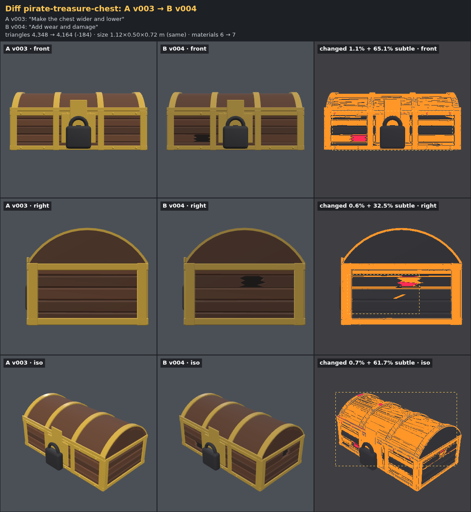
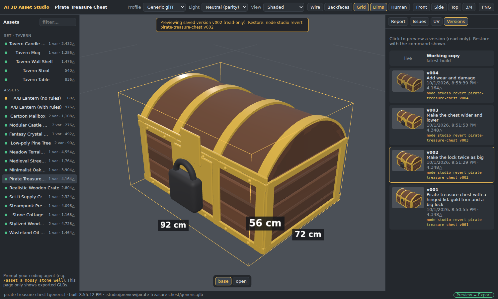

# Phase 4 demo — iteration and version history

**Goal (PRD):** follow-up prompts revise an asset without rebuilding it, every step is a version
you can go back to, and you can see what each revision changed.

**What was added**

| Piece | Where |
| --- | --- |
| `node studio save / history / revert / undo / pin / unpin` | `studio/core/history.js`, `studio/cli/*.js` |
| `node studio diff`: shared-camera renders, change heatmap, stats delta, source diff | `studio/core/diff.js`, `studio/cli/diff.js` |
| Versions panel in the viewport (thumbnails, read-only preview, revert command) | `studio/viewport/app.js` |
| Agent shortcuts `asset`, `asset-revise`, `asset-variants`, `asset-set`, `asset-review`, `asset-export`, `asset-undo` (`/asset…` in Claude Code and Gemini CLI, `$asset…` in Codex) | `.agents/skills/` → `node studio agents` generates `.claude/commands/`, `.gemini/commands/` |
| Revision protocol for the agent | `rules/10-revisions.md`, `AGENTS.md` (Workflow B) |

A version is a snapshot in `.studio/history/<slug>/vNNN/`: the asset source, the generic GLB,
`meta.json` (request, stats, parent) and a thumbnail sheet. Set saves (`save set:tavern`)
snapshot the set folder and every member. History keeps the last 20 versions plus pinned ones.
Every version records its **parent**, so `undo` steps back along the edits that were actually
made, even after a revert. `revert` and `undo` auto-save unsaved changes first.

## The demo: three revisions of the pirate chest

Each step below is what the agent runs for a follow-up prompt (`/asset-revise`): smallest change,
`node studio diff`, review, then `save -m "<the user's words>"`.

In the diff sheets, rows are views and the columns are **A | B | changes**. Both GLBs are rendered
by the same deterministic renderer with one shared camera per view (fitted to the union of both
bounding boxes), so unchanged pixels are identical. **Red** marks strong changes (shape, parts,
clear color changes); **orange** marks subtle color or shading shifts; the dashed box surrounds
the red area.

### v001 — the original prompt

> "Pirate treasure chest with a hinged lid, gold trim and a big lock"

`node studio save pirate-treasure-chest -m "Pirate treasure chest with a hinged lid, gold trim and a big lock"`

### v002 — "Make the lock twice as big"

One param changed: `lockScale: 1.0 → 2.0`.


```
triangles 4,348 → 4,348 (0) · size 0.92×0.56×0.67 → 0.92×0.56×0.72 m · 6 materials
changed pixels: front 8.1% (x 37–63%, y 32–69%), right 0.3% (x 14–17%, y 57–70%), iso 5.0% (x 26–43%, y 43–75%)
source: +1 -1 lines in assets/pirate-treasure-chest/asset.js
```

The change stays on the lock in every view. Depth grows by 5 cm because the padlock sticks out
further.

**Bug found and fixed:** the first run of this diff was red over the whole chest. With the
`base-center` origin computed from the full bounding box, the bigger padlock moved the bounding
box center forward, so the pipeline shifted the entire chest back by 2.5 cm. `base-center` now
uses the center of the **footprint** (the vertices in a thin band above the lowest point), and
the `scene.origin` check uses the same rule (`studio/kit/runtime.js`,
`studio/core/validate/checks/scene.js`). The pivot stays where the asset stands, so growing a
protruding detail no longer moves the asset in the engine after a re-import.

### v003 — "Make the chest wider and lower"

`width: 0.9 → 1.1`, `bodyHeight: 0.38 → 0.32`, and `meta.interpretation` updated to the new size.



```
triangles 4,348 → 4,348 (0) · size 0.92×0.56×0.72 → 1.12×0.50×0.72 m · 6 materials
changed pixels: front 37.9%, right 25.5%, iso 33.9%
source: +3 -3 lines
```

This request changes the whole silhouette, so the whole chest is red, as it should be. The lock
keeps its v002 size, and plank count, bands and seeds are unchanged.

### v004 — "Add wear and damage"

`wear: 0 → 0.7` (an existing param: darker grime, dull gold, missing studs). Damage was a new
kind of variation, so the agent added a new param `damage: 0.7` that snaps a front plank and a
side plank, with jagged ends and a dark gap. It uses a new rng stream (`rng.stream('damage')`),
and the plank loop still draws the same random numbers in the same order, so every other plank
keeps its exact shape.



```
triangles 4,348 → 4,164 (-184) · size 1.12×0.50×0.72 m (same) · materials 6 → 7
changed pixels: front 1.1%, right 0.6%, iso 0.7%            ← red: the two broken planks + missing studs
subtle color/shading changes: front +65.1%, right +32.5%, iso +61.7%   ← orange: grime on wood and gold
source: +32 -6 lines
```

The black iron padlock is the only part with no orange: wear does not touch it in the code, and
the diff confirms that.

## Going back

```
$ node studio history pirate-treasure-chest
pirate-treasure-chest — 4 version(s) (keeps last 20 + pinned · .studio/history/pirate-treasure-chest)
  v001  2026-10-01 20:50    4,348△  "Pirate treasure chest with a hinged lid, gold trim and a big lock"
  v002  2026-10-01 20:51    4,348△  "Make the lock twice as big"
  v003  2026-10-01 20:51    4,348△  "Make the chest wider and lower"
● v004  2026-10-01 20:53    4,164△  "Add wear and damage"

● working copy = v004

$ node studio revert pirate-treasure-chest v002
OK restored pirate-treasure-chest v002 — "Make the lock twice as big" into assets/pirate-treasure-chest/

$ node studio revert pirate-treasure-chest v004
OK restored pirate-treasure-chest v004 — "Add wear and damage" into assets/pirate-treasure-chest/
```

With unsaved changes, `revert` and `undo` first save them as an `auto` version and print its id,
so nothing is lost. `undo` with no unsaved changes goes to the parent version, and running it
again keeps stepping back (`tests/history.test.js` covers this, including auto-save and pruning).

The viewport's **Versions** tab lists the same history with thumbnails. Clicking a version
previews its GLB read-only and shows the command to restore it:



## Reproduce

```bash
node studio history pirate-treasure-chest
node studio diff pirate-treasure-chest v001 v002     # or v002 v003, v003 v004
node studio diff pirate-treasure-chest               # unsaved changes vs the last saved version
```

(The history lives in `.studio/`, which is local state and not committed. On a fresh clone, save
a version first, edit a param, then run `diff`.)
