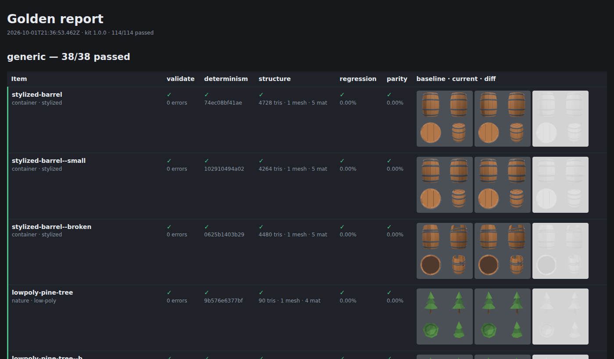

# Phase 5 demo — production workflow and reliability

**Goal (PRD):** a full preflight, export reports, automatic screenshot comparison, engine tests
on the golden set, project organization, asset statistics, and consistency across revisions.
**Done when** a golden set covering several asset types and styles passes validation and looks
right in Godot and Roblox Studio without manual fixes.

| Piece | Command / file |
| --- | --- |
| Strict export: blocked by errors; a fresh rebuild must reproduce the preview byte for byte; parity recorded | `node studio export <target> --profile <p>` → `exports/<profile>/<item>.glb` + `.report.json` + `.report.md` |
| Full report of a build or an export | `node studio report <slug> [--profile p] [--export] [--md]` |
| Project stats and the PRD success metrics | `node studio stats` |
| Environment check | `node studio doctor` |
| Golden suite: validate · determinism · structure · regression · parity, for every profile | `node studio golden` → `golden/report/index.html` |
| Godot check (headless, automatic) and studio-vs-Godot renders | `node studio engine-verify godot [--capture]`, `engines/godot/` |
| Roblox pack: GLBs, manifest, a template place with a verify script, and a checklist | `node studio engine-pack roblox`, `engines/roblox/CHECKLIST.md` |
| CI: tests + golden suite + Godot check on every push | `.github/workflows/ci.yml` |

## Golden set

`golden/golden.json` lists 19 assets. With their variants that is 38 items, which cover:

- types: containers, furniture, props, lighting, nature, a building, a terrain tile, modular
  architecture, and the five members of a set
- styles: stylized, low-poly, realistic (painted textures + normal + ORM), sci-fi (emissive),
  fantasy, post-apocalyptic, medieval, cartoon, steampunk, minimalist
- special cases: a hinged lid part, a back-center origin, tiling textures, emissive materials

Every item is checked in all three profiles (114 checks):

| Check | Meaning |
| --- | --- |
| validate | 0 errors; warnings only from the allow-list (`material.emissive` on Roblox, where emissive import is unverified) |
| determinism | a fresh build reproduces the preview GLB byte for byte (Preview = Export) |
| structure | triangles, meshes, materials (color, metal/rough, alpha mode), textures and size match `golden/manifest.json` |
| regression | front/right/top/iso renders match the committed baseline (`golden/baselines/<profile>/<item>.png`, ≤ 1 % of object pixels) |
| parity | the source three.js scene and the exported GLB render the same from identical cameras (≤ 2 %) |

**Result:** `114/114 passed (generic 38/38, godot 38/38, roblox 38/38)`.



The HTML report (`golden/report/index.html`) shows each check with its value, and the baseline,
current and diff images. To approve an intentional visual change, run
`node studio golden --update-baselines` and commit the new baselines together with the change.

**Speed:** the first full run took 826 s. Profiling showed that every render call rebuilt the
viewport's environment map (PMREM), which takes about 2 s on software WebGL. Caching it per
renderer brought the suite to **122 s**. The renders stayed pixel-identical: the regression check
against the baselines from the slow run reported 0.00 %. Reviews, diffs, exports and thumbnails
got the same speed-up.

## Godot: verified in the real engine

`node studio engine-verify godot` exports the golden set with the Godot profile, then runs
`engines/godot/verify/verify_golden.gd` headless. That script loads every GLB with Godot's own
`GLTFDocument` and compares what Godot sees with the studio's manifest: size and bounds,
triangles, mesh/surface counts, node pivots, albedo (sRGB), alpha, metallic/roughness, texture
slots, emission, transparency and culling.

```
OK packed 38 golden GLBs (Godot profile) → engines/godot/golden
running Godot_v4.7.2-stable_linux.x86_64 (4.7.2.stable.official.ed1daf0bf) headless…
  OK stylized-barrel
  OK stylized-barrel--small
  …
  OK tavern-shelf

OK Godot 4.7.2-stable (official): 38/38 golden items imported without manual fixes (100%)
```

To prove the check is not vacuous, deliberate errors were introduced into the manifest. Each one
failed as it should:

```
FAIL realistic-crate  node 'body' at (0.000, 0.000, 0.000), expected (0.000, 0.500, 0.000); material 'crate_inner' lost its emissive texture; …
FAIL pirate-treasure-chest  4164 triangles, expected 4165; material 'chest_inner' albedo #4a2c1a, expected #ff0000
FAIL tavern-shelf  size (1.011, 0.675, 0.243) m, expected (1.011, 0.725, 0.243) m
```

`--capture` renders every item **in Godot** from the studio's iso camera, with the same
lighting rig as the viewport's Neutral mode. Each pair below is the studio viewport (left) and
Godot 4.7.2 (right):


Shapes, proportions, pivots, UVs, painted textures and colors match. Lighting is close but not
identical, which the PRD allows ("parity does not mean pixel-identical lighting"). The crate's
steel brackets look darker in Godot because this software-rendered capture (Compatibility
renderer under Xvfb) has no sky reflections, and pure metals get their color from reflections.

## Roblox Studio: prepared, checked by hand

Roblox Studio has no headless mode, so the last step needs your machine. Everything up to that
step is automated:

```
$ node studio engine-pack roblox
OK roblox: 19 GLBs in engines/roblox/golden, engines/roblox/GoldenManifest.lua, template place engines/roblox/GoldenVerify.rbxlx
```

- The GLBs use the Roblox profile, which the golden suite checks: studs at 25:7, colors baked
  into textures (the importer ignores `baseColorFactor`), one material per MeshPart, ≤ 20k
  triangles per mesh, ≤ 1024 px textures, 8 px UV padding, and texel density ≥ 90 px/m.
- `GoldenVerify.rbxlx` contains a `GoldenImports` folder, the manifest and the `VerifyGolden`
  script. After you import the GLBs into the folder, Play (or the Command Bar) prints PASS / FAIL /
  MISSING for each item. The script checks size in studs, MeshPart count, textures present and
  DoubleSided off.
- `engines/roblox/CHECKLIST.md` lists the import settings (Scale Unit: Stud), what to look at by
  eye (colors, faces, seams, pivots, emissive) and a results table for the ≥ 90 % target.

## Strict export

```
$ node studio export pirate-treasure-chest --profile all
OK pirate-treasure-chest [generic] → exports/generic/pirate-treasure-chest.glb (249.1 KB, 4,164 tris, 2 mesh) · parity 0.0%
OK pirate-treasure-chest--open [generic] → exports/generic/pirate-treasure-chest--open.glb (249.1 KB, 4,164 tris, 2 mesh) · parity 0.0%
OK pirate-treasure-chest [godot] → exports/godot/pirate-treasure-chest.glb (249.1 KB, 4,164 tris, 2 mesh) · parity 0.0%
OK pirate-treasure-chest--open [godot] → exports/godot/pirate-treasure-chest--open.glb (249.0 KB, 4,164 tris, 2 mesh) · parity 0.0%
OK pirate-treasure-chest [roblox] → exports/roblox/pirate-treasure-chest.glb (237.7 KB, 4,164 tris, 2 mesh) · parity 0.0%
OK pirate-treasure-chest--open [roblox] → exports/roblox/pirate-treasure-chest--open.glb (237.6 KB, 4,164 tris, 2 mesh) · parity 0.0%

6 exported. Reports with import steps: exports/<profile>/<item>.report.md
```

Assets that break an engine limit are not exported:

```
$ node studio export fx-dense fx-padding-bad --profile roblox      # test fixtures
FAIL fx-dense [roblox] blocked: 1 validation error(s)
    FAIL mesh 'body' has 30,300 triangles (limit 20,000 per mesh for Roblox Studio) (scene.mesh-triangles)
        fix: Lower segment counts, remove hidden faces, or split the part. The Roblox importer rejects meshes over 20k triangles.
FAIL fx-padding-bad [roblox] blocked: 1 validation error(s)
    FAIL UV islands in 'tex1_tinted' are only 0px apart at 256×256 (needs ≥ 8px for Roblox Studio); colors will bleed at a distance (uv.padding)
        fix: Repack with k.uv.atlas(entries, { padding: 8 }) or give the texture more resolution.

0 exported, 2 blocked.
```

The `.report.md` next to each export holds the size (m and studs), meshes, materials, textures
with texel density and UV padding, the conversions the engine profile made (palette atlas,
studs, tile bake…), the issues with fixes, parity, and the import steps for that engine.

## Stats and success metrics

```
$ node studio stats
…
Success metrics
  time to first GLB (median of 5 timed asset(s)): 1m 36s  ✓ under 5 min
  Godot import without manual fixes: 38/38 (100%, Godot 4.7.2-stable (official), 2026-10-01)  ✓ ≥ 90%
  Roblox import without manual fixes: measured in Roblox Studio — engines/roblox/CHECKLIST.md
  revision prompts per saved asset: 3
```

Timed assets are the ones created with `node studio new` / `new-set`: here, the five tavern
props, which took 1m21s–2m06s from the prompt to the first GLB. The earlier demo assets were
written before timing existed. The revision count comes from the history (the chest demo in
Phase 4).

## CI

`.github/workflows/ci.yml` has two jobs:

- **Tests + golden suite:** `npm ci`, the Chromium build pinned by Playwright 1.56.1 (the same
  SwiftShader WebGL that rendered the baselines), `npm test`, `node studio doctor` and
  `node studio golden`. The golden HTML report is uploaded as an artifact.
- **Godot import check:** downloads Godot 4.7.2 and runs `node studio engine-verify godot`.
