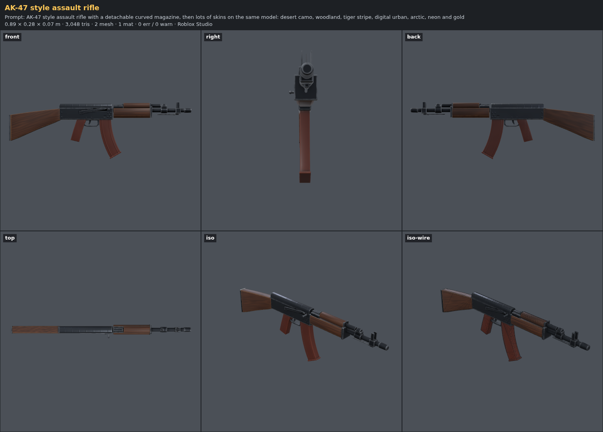
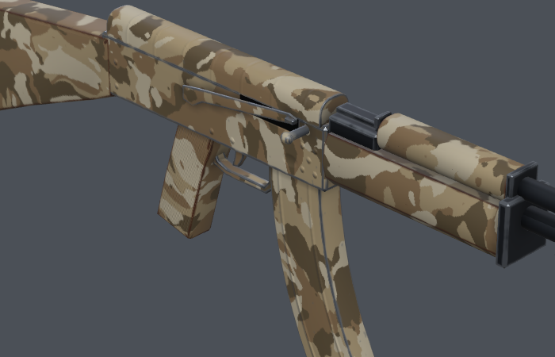
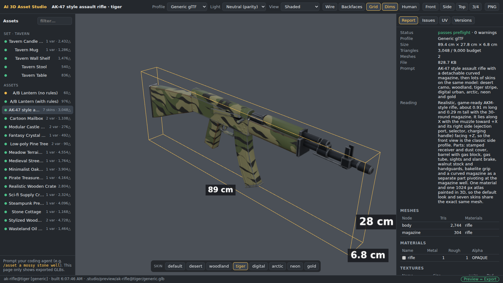

# Skins demo — one AK, eight looks, published to Roblox

**Goal:** generate an AK-47 style rifle once, then many textures/skins on the **same model**,
and deliver them to engines (Roblox SurfaceAppearance swap, glTF variants, Godot) — including
an upload to Roblox without a manual import.

```
/asset AK-47 style assault rifle with a detachable curved magazine
/asset-skins ak-rifle desert camo, woodland, tiger stripe, digital urban, arctic, neon and gold
/asset-publish ak-rifle skins
```

## The model

`assets/ak-rifle`: 0.89 × 0.28 × 0.07 m, 3,048 triangles, 2 meshes (body + the detachable
magazine, pivot at the magazine well), **one material and one 1024 px atlas**. It lies along X
with the muzzle toward +X, so the front view is the side profile.



## Eight looks, same mesh

`node studio review ak-rifle --skins` → the skin sheet (every look from the same cameras):


Every skin is a few param overrides (`skins: { desert: { coat: 'camo', coatColors: [...] } }`).
The textures are painted in 3D (`k.bake.surface` + `painter.paint3d`): the camo runs across UV
seams and from part to part, worn edges show bare steel, grime sits in cavities.



The skin lock compared each look with the default in every profile: **24 builds (8 looks × 3
profiles), 0 errors, 0 warnings, parity 0.00 %**. A skin that changed a size or a material slot
would fail with `skin.geometry-changed` / `skin.materials-changed` (`tests/skins.test.js`).

The viewport's **Skin bar** switches looks:



## Export: what each engine gets

```
$ node studio export ak-rifle --skins --profile all
OK ak-rifle [generic] → exports/generic/ak-rifle.glb (797.1 KB, 3,048 tris, 2 mesh) · parity 0.0%
OK ak-rifle@desert [generic] → exports/generic/ak-rifle@desert.glb (887.1 KB, 3,048 tris, 2 mesh) · parity 0.0%
…
OK ak-rifle.skins [generic] → exports/generic/ak-rifle.skins (8 looks)
  OK all looks in one GLB (KHR_materials_variants) → exports/generic/ak-rifle.skins.glb
OK ak-rifle.skins [godot] → exports/godot/ak-rifle.skins (8 looks)
OK ak-rifle.skins [roblox] → exports/roblox/ak-rifle.skins (8 looks)

24 exported · 3 skin pack(s).
```

- **Roblox:** per look and MeshPart a ColorMap, MetalnessMap, RoughnessMap and NormalMap,
  `skins.json` and `SkinSwitcher.lua`.
- **glTF:** `ak-rifle.skins.glb` — all 8 looks in 4.4 MB (the shared normal map is stored once),
  0 errors and 0 warnings in the Khronos validator.
- **Godot:** one GLB per look plus the maps.

## Publish to Roblox

```
$ node studio publish ak-rifle --roblox --skins --dry-run
Dry run: publishing 1 item(s) to Roblox with skins
~ ak-rifle: model would create
~ ak-rifle: 8 looks, 32 maps (18 would upload, 14 shared with another look or uploaded before)
```

Without `--dry-run` it uploads the model (later: new versions of the same asset), the 18
distinct maps as Images, and writes `exports/roblox/ak-rifle.skins.rbxmx` (Skins/<look>/body and
/magazine SurfaceAppearances + SkinSwitcher). The upload path is tested against a local fake
Open Cloud server; a real upload needs your API key (`docs/GUIDE.md` → Publish to Roblox).
